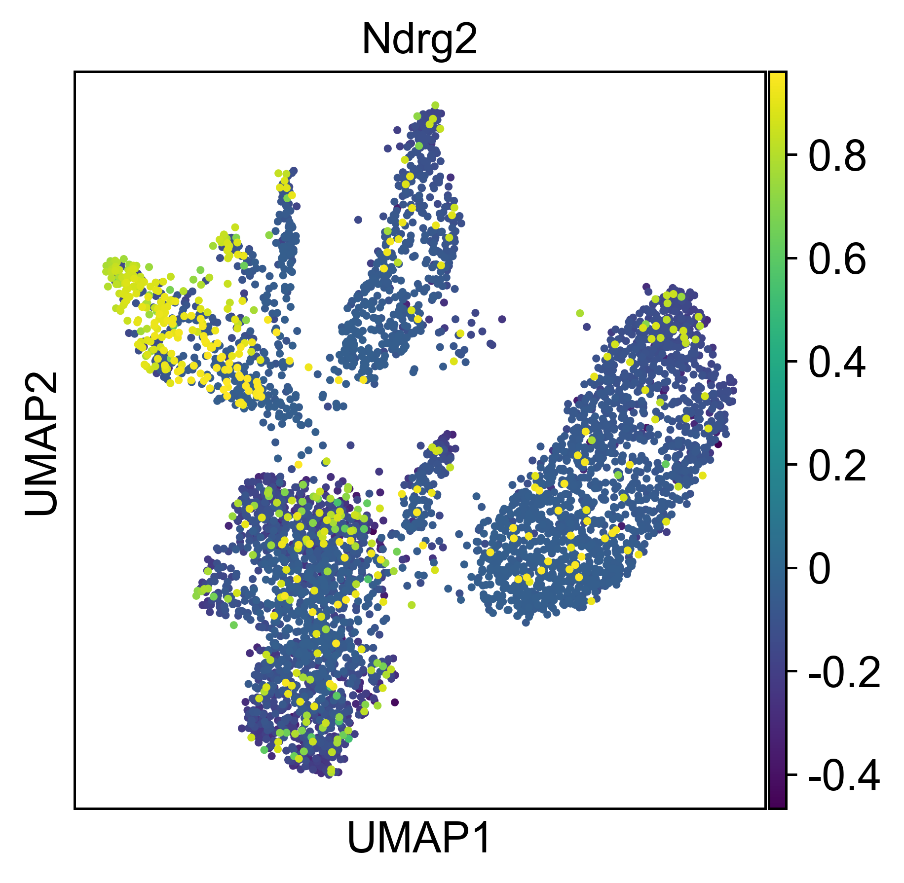
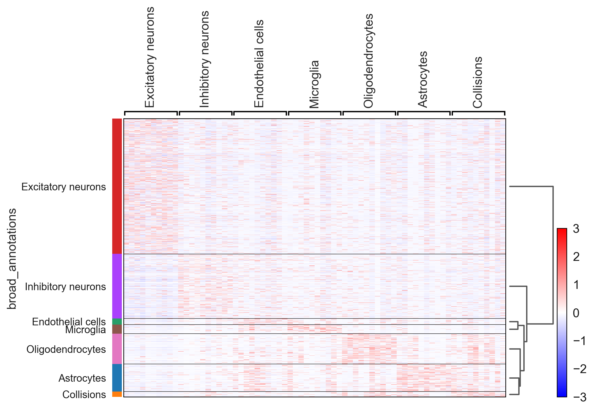
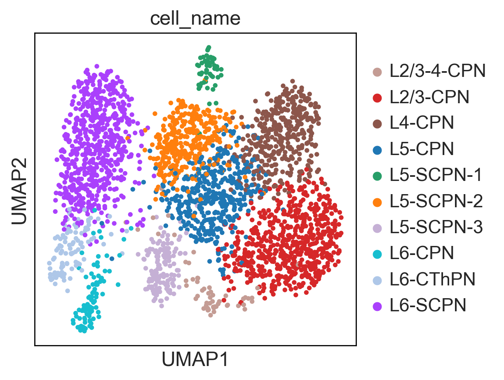
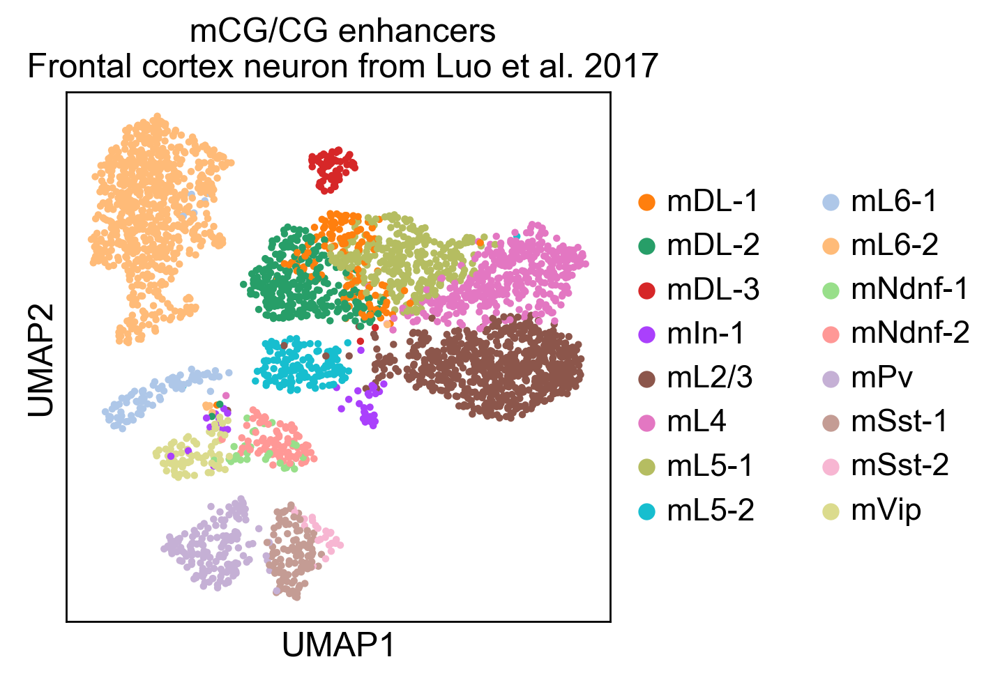

Tutorials
=========

------------

Single cell ATAC-seq
--------------------

To get started, we recommend epiScanpy's analysis pipeline for scATAC-seq data for 10k PBMCs from 10x Genomics. This tutorial focuses on preprocessing, clustering, identification of cell types via known marker genes and trajectory inference. The tutorial can be found `here <https://nbviewer.jupyter.org/github/colomemaria/epiScanpy/blob/master/docs/tutorials/beta_tutorial_10x_pbmc.html>`__. 

NB: The current tutorial is a beta version that do not include either optimal low embedding & clustering settings or proper cell type identifications. To check out performance see other tutorials below and an updated version will be available very soon. 

.. image:: pictures/pbmc_PCA_coverage.png
   :width: 200px
.. image:: pictures/pbmc_umap.png
   :width: 190px
.. image:: pictures/pbmc_diffmap.png
   :width: 200px

If you want to see how to build count matrices from ATAC-seq bam files for different set of annotations (like enhancers).
The tutorial can be found `here <https://nbviewer.jupyter.org/github/colomemaria/epiScanpy/blob/master/docs/tutorials/ATAC_bld_ct_mtx_tutorial.html>`__. 

Soon available, there will be a tutorial providing a function to very quickly build custom count matrices using standard 10x single cell ATAC output. 

.. image:: pictures/umap.png
   :width: 350px

An additional tutorial on processing and clustering count matrices from the Cusanovich mouse scATAC-seq atlas [Cusanovich18]. `Here <https://nbviewer.jupyter.org/github/colomemaria/epiScanpy/blob/master/docs/tutorials/Cusanovich2018_BoneMarrow_data_processing_diffmap.html>`__.

------------

Single cell DNA methylation
---------------------------

Here you can find a tutorial for the preprocessing, clustering and identification of cell types for single-cell DNA methylation data using the publicly available data from Luo et al. [Luo17]_. 

The first tutorial shows how to build the count matrices for the different feature spaces (windows, promoters) in different cytosine contexts. Here is the  `tutorial  <https://nbviewer.jupyter.org/github/colomemaria/epiScanpy/blob/master/docs/tutorials/bld_count_matrix_methylation_tutorial.html>`__.

Then, there is a second tutorial on how to use them and compare the results. The data used comes from mouse brain (frontal cortex). It will be available very soon.

.. image:: pictures/umap_markers_hodology_ecker.png
   :width: 600px

.. image:: pictures/umapSatb2_CLUSTER_NORM.png
   :width: 250px  

